# End-to-End Workflow — ORDITO Core (Existing Product)

The complete flow from strategic origin to post-release learning. **Core mode**: existing product, stable team, full gates.

In loom terms: each phase is a pass of the weft through the tense warp. Gates verify that the tension is still regular before the next pass.

## Process diagram

```mermaid
flowchart TD
    Start([0. Strategic Trigger]) --> Charter[Initiative Charter]
    Charter --> Intake[1. Intake]
    Intake --> IntakeAI{{Intake Coach}}
    IntakeAI --> FRQ[Feature Request<br/>FRQ score]
    FRQ --> Prio[2. Prioritization]
    Prio --> PrioAI{{Prioritization Copilot}}
    PrioAI --> SAS[SAS + RCS<br/>Risk Band]
    SAS --> G0{Backlog?}
    G0 -- No --> Stop1([Parking lot])
    G0 -- Yes --> Discovery[3. Discovery]
    Discovery --> DiscAI{{Brief Builder +<br/>Research Synthesizer}}
    DiscAI --> Brief[Feature Brief Pack]
    Brief --> G1{Gate G1<br/>Commitment}
    G1 -- NO-GO --> Stop2([Archived])
    G1 -- HOLD --> Discovery
    G1 -- GO reduced --> Design
    G1 -- GO --> Design[4. Solution Design]
    Design --> DesAI{{Design Critic +<br/>Solution Mapper}}
    DesAI --> Specs[Design Spec + TDN]
    Specs --> G2{Gate G2<br/>Build-ready}
    G2 -- Not ready --> Design
    G2 -- Hotfix override --> Build
    G2 -- Ready --> Build[5. Build]
    Build --> BuildAI{{Code Review Agent}}
    BuildAI --> Validate[6. Validate]
    Validate --> ValAI{{Test Case Generator}}
    ValAI --> Release{Gate Release}
    Release -- Blocker --> Build
    Release -- Verifier{{Release Verifier}} --> Rollout
    Rollout[7. Release<br/>dark/beta/full] --> Learn[8. Learn]
    Learn --> LearnAI{{Dashboard Narrator}}
    LearnAI --> Impact[Impact Review<br/>7/14/30 days]
    Impact --> LG{Gate Learning}
    LG -- Value confirmed --> Done([✓ Initiative closed])
    LG -- Pivot needed --> Charter
    LG -- Kill --> Stop3([Documented sunset])

    classDef aiservice fill:#e1f5ff,stroke:#0288d1,stroke-width:2px
    classDef gate fill:#fff3e0,stroke:#f57c00,stroke-width:2px
    classDef artifact fill:#f3e5f5,stroke:#7b1fa2,stroke-width:1px
    classDef terminal fill:#e8f5e9,stroke:#2e7d32,stroke-width:2px

    class IntakeAI,PrioAI,DiscAI,DesAI,BuildAI,ValAI,LearnAI aiservice
    class G0,G1,G2,Release,LG gate
    class Charter,FRQ,SAS,Brief,Specs,Impact artifact
    class Done,Stop1,Stop2,Stop3 terminal
```

## Legend

- 🟦 **Blue boxes** — AI services in the service mesh (the accelerated shuttle)
- 🟧 **Orange diamonds** — Decision gates (where warp tension is verified)
- 🟪 **Purple boxes** — Contractual artifacts (the weft thread)
- 🟩 **Green boxes** — Terminal states

## Operational notes

**On gates.** Gates are not code reviews — they are commitment decisions with explicit owners. Each gate produces a decision log that lives in the artifact. Think of them as inspection points where the weaver verifies the pattern is emerging as intended.

**On G2 override.** Override for hotfix is allowed but requires documentation recovery within 48h (override policy documented in `01-framework/principles.md`, coming v1.2). If G2 overrides exceed 15% of releases, the system is degenerating — the warp has loosened.

**On the Learning Gate return.** The learning loop can close the initiative, but it can also relaunch it with a new Charter. This is the mechanism that prevents accumulation of dead features.
