# Operational Swimlane — ORDITO Explore

Visualization for the **Explore mode**: new MVP, uncertain market, explicit kill criteria.

Explore mode adjusts the warp tension downward: fewer mandatory artifacts, lighter gates, explicit kill criteria from phase 0. The goal is to learn fast and kill fast — not to produce perfect documentation.

> **Phase numbering**: aligned with the canonical 0–8 sequence. Phases 0–3 are compressed; phases 4–8 follow the Core pattern with lighter documentation requirements.

## Key differences from Core

- **Gate G0** includes explicit kill criteria (not just backlog decision)
- **Gate G1** requires hypothesis + minimum ACs only (no full Brief Pack)
- **Gate G2** is optional if scope is narrow rollout only
- **Release** defaults to narrow rollout (beta/limited) — never dark launch as default
- **Learning Gate** may produce a Kill decision (documented sunset) — this is success, not failure
- **AI services**: research-synthesizer and brief-builder are primary; solution-mapper and dependency-mapper are optional

## Swimlane diagram

```mermaid
flowchart LR
    subgraph T["0. Strategic Trigger"]
        T1[Opportunity Brief<br/>+ Kill Criteria]
    end

    subgraph S["1. Intake"]
        S1{{Intake Coach}}
        S2[Feature Request<br/>min. version]
        S1 --> S2
    end

    subgraph P["2. Prioritization"]
        P1{{Prioritization Copilot}}
        P2[SAS · Kill threshold]
        P1 --> P2
    end

    subgraph D["3. Discovery / Explore Sprint"]
        D1{{Brief Builder<br/>Research Synthesizer}}
        D2[MVP Frame<br/>hypothesis + ACs]
        D1 --> D2
    end

    subgraph SD["4. Solution Design"]
        SD1{{Design Critic}}
        SD2[Lightweight Design Spec]
        SD1 --> SD2
    end

    subgraph B["5. Build"]
        B1{{Code Review Agent}}
        B2[MVP Build + Flags]
        B1 --> B2
    end

    subgraph V["6. Validate"]
        V1{{Test Case Generator}}
        V2[Minimal Release Checklist]
        V1 --> V2
    end

    subgraph R["7. Release"]
        R1[Narrow Rollout<br/>beta / limited cohort]
    end

    subgraph L["8. Learn / Decide"]
        L1{{Dashboard Narrator}}
        L2[MVP Decision Review<br/>pivot · persevere · kill]
        L1 --> L2
    end

    T --> S --> P --> D --> SD --> B --> V --> R --> L

    classDef ai fill:#e1f5ff,stroke:#0288d1,stroke-width:2px
    class S1,P1,D1,SD1,B1,V1,L1 ai
```



## Actors × phases map

| Lane | 0 Trigger | 1 Intake | 2 Prioritization | 3 Discovery | 4 Solution Design | 5 Build | 6 Validate | 7 Release | 8 Learn |
|---|---|---|---|---|---|---|---|---|---|
| **Founder / Sponsor** | Opportunity Brief + kill criteria | — | Kill threshold sign-off | — | — | — | — | Narrow rollout approval | Pivot / kill decision |
| **Product Lead** | — | MVP scope | SAS review | MVP Frame owner | Scope lock | Clarifications | UAT signoff | Rollout coordination | Impact decision |
| **UX Lead** | — | — | — | User research | Lightweight Design Spec | Design QA | — | — | UX learnings |
| **Engineering Lead** | — | Feasibility | Effort estimate | Tech risks | — | Build supervision | — | Release approval | Debt actions |
| **QA / Release** | — | — | — | — | Test strategy | Automation checks | Minimal Checklist | — | Defect triage |
| **AI Services** | — | Intake Coach | Prioritization Copilot | Brief Builder + Research Synthesizer | Design Critic | Code Review Agent | Test Case Generator | — | Dashboard Narrator |
| **Artifact produced** | Opportunity Brief | FRQ (min) | Risk band | MVP Frame | Design Spec (light) | Build + flags | Checklist (min) | — | MVP Decision Review |

## Kill criteria

Kill criteria must be defined at phase 0 and made explicit in the Opportunity Brief. A Learning Gate that triggers the kill decision is a success — it freed resources before a larger investment was made.

Example kill criteria format:
```yaml
kill_criteria:
  - metric: weekly_active_users
    threshold: "<50 in beta cohort after 4 weeks"
  - metric: conversion_rate
    threshold: "<2% from trial to paid"
  - trigger: "3 consecutive weeks of declining usage"
```

## Common antipatterns in Explore mode

1. **Scope creep into Core.** If the Brief Pack grows beyond hypothesis + ACs, the team has shifted into Core without acknowledging it. Recognize and reframe.
2. **Missing kill criteria.** An Explore initiative without kill criteria is a Core initiative in disguise. Add them at G0 or escalate to Core mode.
3. **Skipping the Learning Gate.** The Learning Gate is mandatory even when the MVP fails — especially when it fails. The kill documentation is the artifact.
