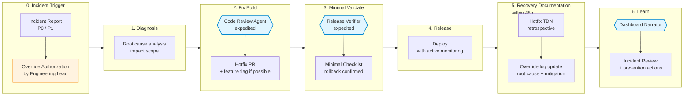

# Operational Swimlane — ORDITO Hotfix

Visualization for the **Hotfix mode**: authorized G2 override for urgent production issues.

Hotfix mode is not a shortcut — it is a tracked exception. The override is the right of the human owner, but it generates a debt that must be repaid within 48 hours through recovery documentation.

> **Override threshold**: if G2 overrides exceed 15% of releases in a quarter, the system is degenerating. The warp has loosened. Escalate to a framework retrospective.

## Activation criteria

Hotfix mode may only be activated when **all three** conditions are met:

1. A production incident is active or imminent (P0 or P1 severity)
2. The normal G2 gate cannot be completed within the incident SLA
3. An authorized override owner (Engineering Lead or above) explicitly approves and logs the override

If any condition is absent, use Core mode with an expedited timeline.

## Swimlane diagram



## Actors × phases map

| Lane | 0 Trigger | 1 Diagnosis | 2 Fix Build | 3 Validate | 4 Release | 5 Recovery Docs | 6 Learn |
|---|---|---|---|---|---|---|---|
| **Engineering Lead** | Override authorization | Root cause | Build supervision | Release approval | Deploy approval | TDN owner | Prevention actions |
| **Product Lead** | Informed | Impact assessment | — | UAT if needed | Rollout decision | Override log owner | Incident review |
| **QA / Release** | — | Scope | Automation checks | Minimal Checklist | Rollback verification | — | Defect closure |
| **Staff Engineer** | Escalation (P0 only) | Architecture assessment | Code review | — | — | Recovery review | Architecture retrospective |
| **AI Services** | — | — | Code Review Agent (expedited) | Release Verifier (expedited) | — | — | Dashboard Narrator |
| **Artifact produced** | Incident Report + Override Auth | Root cause doc | Hotfix PR | Minimal Checklist | — | Hotfix TDN + override log | Incident Review |

## Override log format

Every G2 override must produce an entry in the artifact's `decision_log` within 48 hours:

```json
{
  "timestamp": "2026-03-20T14:30:00Z",
  "decision": "G2 override authorized for hotfix of P0 invoice validation failure",
  "rationale": "Active incident affecting 3 enterprise customers. Normal G2 gate timeline (48h) would exceed incident SLA (4h). Root cause identified, risk of further spread contained.",
  "owner": "engineering_lead",
  "ai_service_overridden": null
}
```

## Recovery documentation (within 48h)

Recovery documentation is not optional. It converts the override debt into learning. Required documents:

1. **Hotfix TDN** — abbreviated Technical Design Note: what changed, why, what the risk was, what the rollback is
2. **Override log entry** — in the artifact's `decision_log` (see format above)
3. **Root cause update** — in the Incident Report: what systemic issue allowed this situation

## Override threshold monitoring

Track in your team's metrics:

```
G2_override_rate = count(hotfix_releases) / count(total_releases) — rolling 13 weeks
```

Alert at: **>10%** (yellow). Escalate at: **>15%** (red — framework retrospective required).

A high override rate means the warp has loosened: gates are too slow, documentation requirements are too heavy, or the team is under structural pressure that bypasses process. The metric is diagnostic, not punitive.
