# Operational Swimlane — ORDITO Scale

Visualization for the **Scale mode**: complex legacy systems, multi-team coordination, compliance requirements.

Scale mode increases the warp tension: additional mandatory artifacts, dependency mapping, architecture sign-off, audit trail. The goal is traceability and control over a large surface area — not speed.

> **Phase numbering**: aligned with the canonical 0–8 sequence. Scale mode adds mandatory checkpoints between phases 3–4 (dependency review) and 4–5 (architecture sign-off).

## Key differences from Core

- **Gate G1** requires dependency mapping in addition to the full Brief Pack
- **Gate G2** requires architecture sign-off from Staff Engineer
- **Compliance checker** AI service is active from phase 3
- **Dependency mapper** AI service is active in phase 4
- **Release** requires staged rollout plan with explicit rollback
- All phases produce full audit trail (no session-only artifacts)

## Swimlane diagram

```mermaid
flowchart LR
    subgraph T["0. Strategic Trigger"]
        T1[Initiative Charter<br/>+ compliance flags]
    end

    subgraph S["1. Intake"]
        S1{{Intake Coach}}
        S2[Feature Request<br/>full version]
        S1 --> S2
    end

    subgraph P["2. Prioritization"]
        P1{{Prioritization Copilot}}
        P2[SAS / RCS · Dependency flags]
        P1 --> P2
    end

    subgraph D["3. Discovery"]
        D1{{Brief Builder<br/>Research Synthesizer<br/>Compliance Checker}}
        D2[Feature Brief Pack<br/>+ compliance assessment]
        D1 --> D2
    end

    subgraph SD["4. Solution Design"]
        SD1{{Design Critic<br/>Solution Mapper<br/>Dependency Mapper}}
        SD2[Design Spec + TDN<br/>+ dependency matrix]
        SD1 --> SD2
    end

    subgraph ArchReview["4b. Architecture Sign-off"]
        AR1[Staff Engineer review]
        AR2[Architecture approval]
        AR1 --> AR2
    end

    subgraph B["5. Build"]
        B1{{Code Review Agent}}
        B2[PR + Tests + Flags<br/>+ compliance checks]
        B1 --> B2
    end

    subgraph V["6. Validate"]
        V1{{Test Case Generator<br/>Release Verifier<br/>Compliance Checker}}
        V2[Release Checklist<br/>+ rollback plan]
        V1 --> V2
    end

    subgraph R["7. Release"]
        R1[Staged Rollout<br/>dark → beta → full<br/>with rollback SLA]
    end

    subgraph L["8. Learn"]
        L1{{Dashboard Narrator}}
        L2[Impact Review<br/>+ architecture retrospective]
        L1 --> L2
    end

    T --> S --> P --> D --> SD --> ArchReview --> B --> V --> R --> L

    classDef ai fill:#e1f5ff,stroke:#0288d1,stroke-width:2px
    class S1,P1,D1,SD1,B1,V1,L1 ai
```



## Actors × phases map

| Lane | 0 Trigger | 1 Intake | 2 Prioritization | 3 Discovery | 4 Solution Design | 4b Arch Sign-off | 5 Build | 6 Validate | 7 Release | 8 Learn |
|---|---|---|---|---|---|---|---|---|---|---|
| **Sponsor / Business** | Initiative Charter | Investment framing | — | — | — | — | — | Release awareness | Rollout approval | Value checkpoint |
| **Product Lead** | — | Feature Request | SAS / RCS review | Brief Pack owner | Scope lock | — | Clarifications | UAT signoff | Rollout decision | Impact decision |
| **UX Lead** | — | — | — | Research input | Design Spec | — | Design QA | Support copy | — | Learned UX gaps |
| **Engineering Lead** | — | Feasibility note | Effort band | Tech risks | Technical Design | Architecture review | Build supervision | — | Release approval | Debt actions |
| **Staff Engineer** | — | — | — | Architecture risk flag | TDN review | Sign-off (required) | Cross-team coordination | — | Rollback readiness | Architecture retrospective |
| **QA / Release** | — | — | Risk class | Test strategy seed | Test plan | — | Automation checks | Release Checklist + rollback | — | Defect review |
| **Compliance** | Compliance flags | — | — | Compliance assessment | — | Compliance sign-off | — | Final compliance check | — | Audit trail closure |
| **AI Services** | — | Intake Coach | Prioritization Copilot | Brief Builder + Research Synthesizer + Compliance Checker | Design Critic + Solution Mapper + Dependency Mapper | — | Code Review Agent | Test Case Generator + Release Verifier + Compliance Checker | — | Dashboard Narrator |
| **Artifact produced** | Charter | FRQ | Risk band + dep. flags | Brief Pack + compliance | Design Spec + TDN + dep. matrix | Architecture approval | PR + tests + flags | Checklist + rollback plan | — | Impact Review + arch retro |

## Scale-specific artifacts

### Dependency Matrix

Produced at phase 4 by Dependency Mapper. Format:

```yaml
dependency_matrix:
  - id: DEP-001
    type: team
    name: "Team B — Billing API"
    integration_point: "batch insert endpoint"
    risk: medium
    owner: engineering_lead_team_b
    coordination_required: true
    blocking_gate: G2
  - id: DEP-002
    type: system
    name: "Audit Module"
    integration_point: "import registration hook"
    risk: high
    owner: staff_engineer
    coordination_required: true
    blocking_gate: G2
```

### Architecture Sign-off

Required at phase 4b. Documents:

```yaml
architecture_signoff:
  artifact_ref: TDN-2026-XXX
  reviewer: staff_engineer
  signed_at: "ISO 8601 timestamp"
  verdict: "approved | approved_with_conditions | rejected"
  conditions:
    - "Load test required before G2"
    - "Rollback procedure must be documented"
```

## Common antipatterns in Scale mode

1. **Architecture sign-off treated as rubber stamp.** If the Staff Engineer only reads the TDN without challenging it, the gate is theater. The sign-off produces conditions — that's its value.
2. **Dependency matrix outdated by release.** DEP entries must be updated as dependencies are resolved. A stale matrix creates false confidence at G2.
3. **Compliance check deferred to release.** Compliance Checker must run in phase 3 and again in phase 6. A compliance issue found at release is a 2-week delay minimum.
