# Operational Swimlane — ORDITO Core

Visualization of work flow across roles (lanes), with AI services and artifacts handing off the baton.

In a loom, each warp thread is a "lane" — it stays tense and parallel to the others. The weft passes through them in sequence, phase after phase, leaving a pattern that emerges left to right.

> **Canonical phase numbering** — aligned with `end-to-end-existing.md`. Phase 0 is the Strategic Trigger; phases 1–8 are the active workflow phases. Gate names: G0 (backlog entry), G1 (commitment), G2 (build-ready), Release, Learning.

## Swimlane diagram

```mermaid
flowchart LR
    subgraph T["0. Strategic Trigger"]
        T1[Initiative Charter]
    end

    subgraph S["1. Intake"]
        S1{{Intake Coach}}
        S2[Feature Request]
        S1 --> S2
    end

    subgraph P["2. Prioritization"]
        P1{{Prioritization Copilot}}
        P2[SAS / RCS · Risk Band]
        P1 --> P2
    end

    subgraph D["3. Discovery"]
        D1{{Brief Builder<br/>Research Synthesizer}}
        D2[Feature Brief Pack]
        D1 --> D2
    end

    subgraph SD["4. Solution Design"]
        SD1{{Design Critic<br/>Solution Mapper}}
        SD2[Design Spec + TDN]
        SD1 --> SD2
    end

    subgraph B["5. Build"]
        B1{{Code Review Agent}}
        B2[PR + Tests + Flags]
        B1 --> B2
    end

    subgraph V["6. Validate"]
        V1{{Test Case Generator<br/>Release Verifier}}
        V2[Release Checklist]
        V1 --> V2
    end

    subgraph R["7. Release"]
        R1[Rollout<br/>dark / beta / full]
    end

    subgraph L["8. Learn"]
        L1{{Dashboard Narrator}}
        L2[Impact Review<br/>7 / 14 / 30 days]
        L1 --> L2
    end

    T --> S --> P --> D --> SD --> B --> V --> R --> L

    classDef ai fill:#e1f5ff,stroke:#0288d1,stroke-width:2px
    class S1,P1,D1,SD1,B1,V1,L1 ai
```

## Actors × phases map

Each row is a warp thread (a role). Each column is a weft pass (a phase). Empty cells mean "no direct responsibility in this phase" (may be informed).

| Lane | 0 Trigger | 1 Intake | 2 Prioritization | 3 Discovery | 4 Solution Design | 5 Build | 6 Validate | 7 Release | 8 Learn |
|---|---|---|---|---|---|---|---|---|---|
| **Sponsor / Business** | Initiative Charter | Investment framing | — | — | — | — | Release awareness | Rollout approval | Value checkpoint |
| **Product Lead** | — | Feature Request | SAS / RCS review | Brief Pack owner | Scope lock | Clarifications | UAT signoff | Rollout decision | Impact decision |
| **UX Lead** | — | — | — | Research input | Design Spec | Design QA | Support copy | — | Learned UX gaps |
| **Engineering Lead** | — | Feasibility note | Effort band | Tech risks | Technical Design | Build supervision | — | Release approval | Debt actions |
| **QA / Release** | — | — | Risk class | Test strategy seed | Test plan | Automation checks | Release Checklist | — | Defect review |
| **AI Services** | — | Intake Coach | Prioritization Copilot | Brief Builder + Research Synthesizer | Design Critic + Solution Mapper | Code Review Agent | Test Case Generator + Release Verifier | — | Dashboard Narrator |
| **Artifact produced** | Charter | FRQ | Risk band | Brief Pack | Design Spec + TDN | PR + tests + flags | Checklist | — | Impact Review |

## How to read the swimlane

**Left to right**: time, the shuttle's movement. Each column is a workflow phase.

**Top to bottom**: the roles, the warp threads. Each row is an actor (human or AI).

**The cells**: the concrete action or artifact produced in that phase by that role — the point where the weft crosses that warp thread.

**The key principle**: handoffs between columns happen via contractual artifacts. No phase consumes "discussions" or "opaque documents" from the previous phase — it consumes artifacts with minimum fields and status.

## Common antipatterns

1. **Empty cells become loaded.** If a Sponsor starts writing FRQs directly, the Product Lead's filter is bypassed. Resolve: redirect with coaching, don't reject.
2. **AI bypasses the actor.** If Brief Builder produces the Brief Pack and nobody reviews it, the Brief Pack is worthless. Human review is part of the artifact.
3. **"Learn" gets forgotten.** When a team is under pressure, it's the first phase to be skipped. It's also the one that produces the framework's compound value. Protect it.
